# graph-datasets-stats

Gathered from [cwpearson/graph-datasets](https://github.com/cwpearson/graph-datasets)

## SNAP

| a | edges binned by node IDs | edges binned by node nbr list size |
|-|-|-|
amazon0302_adj |  | 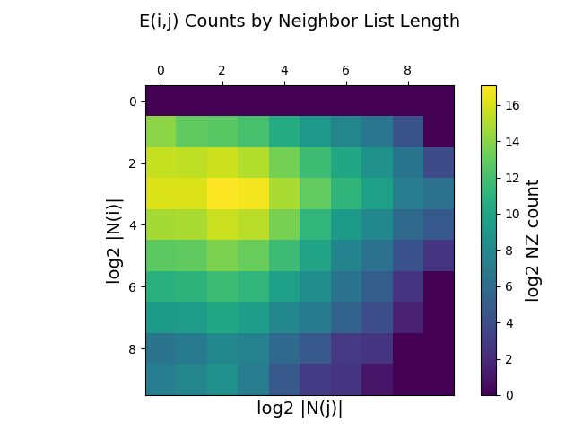
cit-Patents_adj | 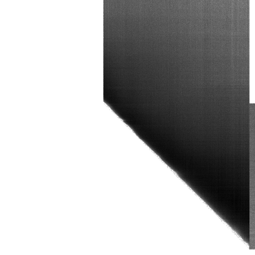 | 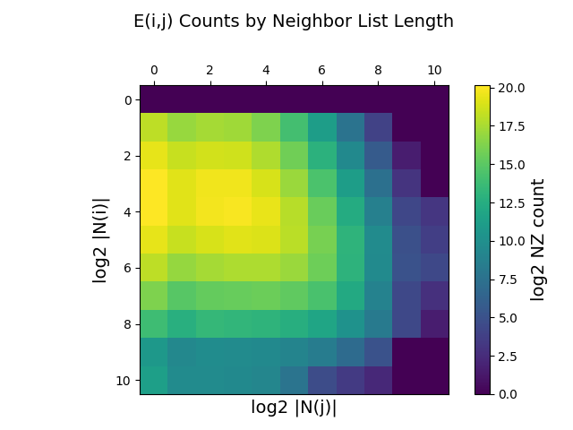
flickrEdges_adj | 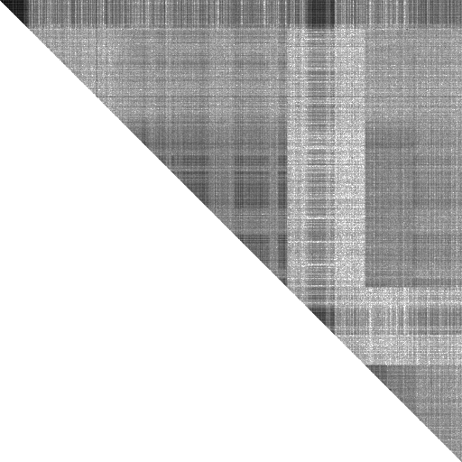 | 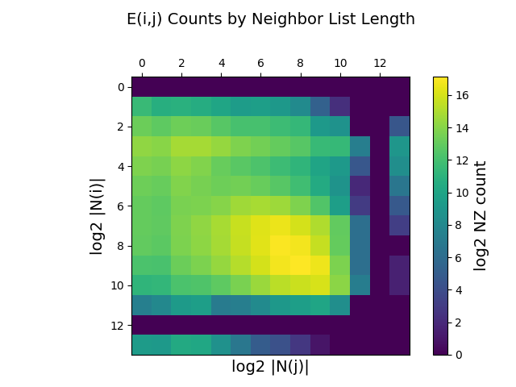
friendster_adj | 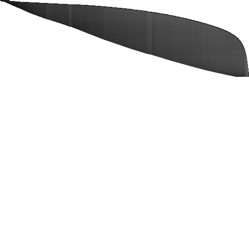 | 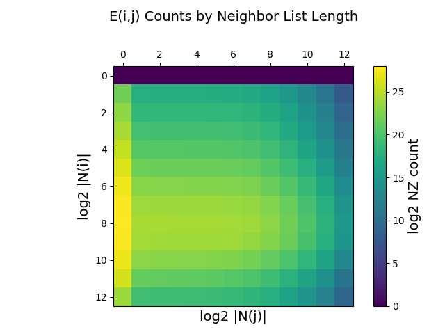
oregon1_010331_adj | 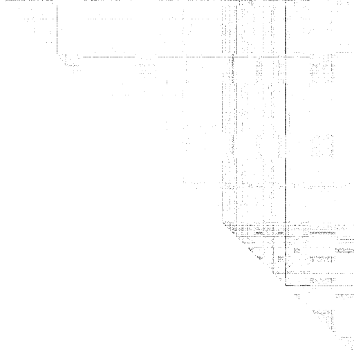 | 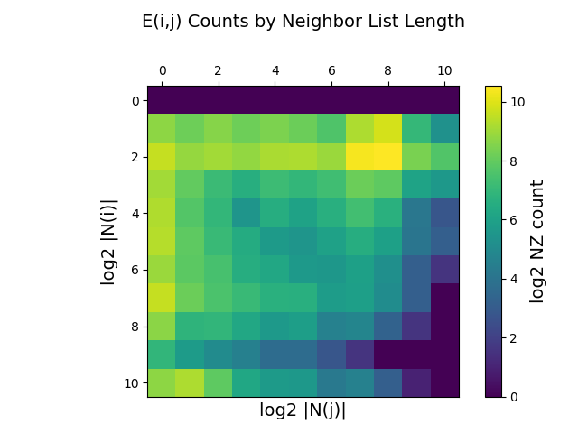
roadNet-CA_adj | 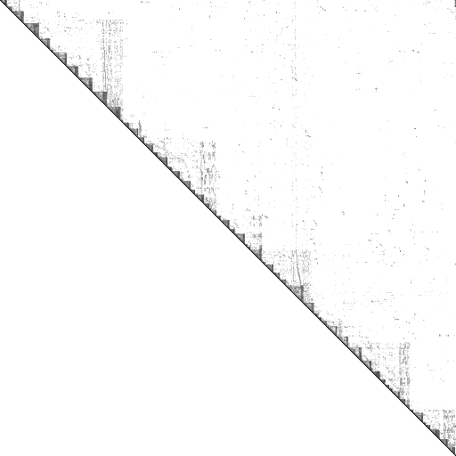 | 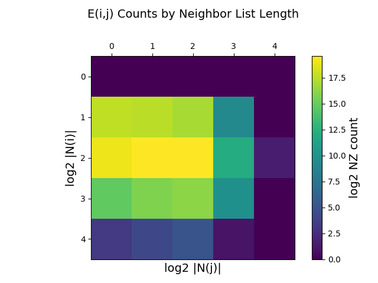

## K-mer

| a | edge binned by ID | nz binned by neighbor list |
|-|-|-|
A2a | 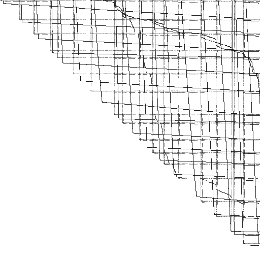 | 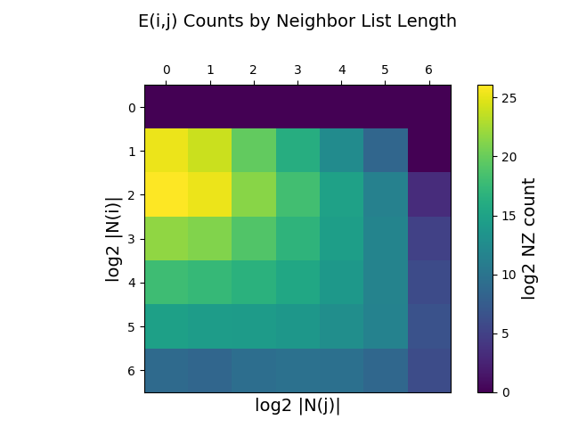
U1a | 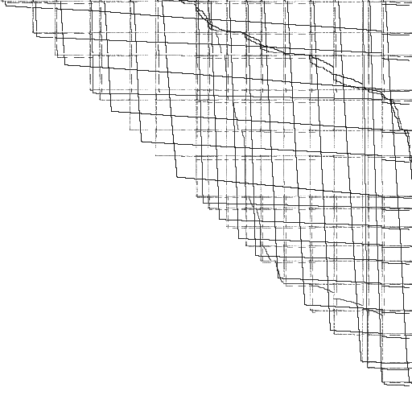 | 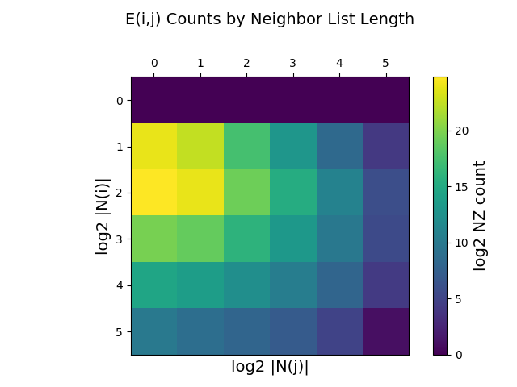

## GraphChallenge

| a | edge binned by ID | nz binned by neighbor list |
|-|-|-|
graph500-scale18-ef16_adj | 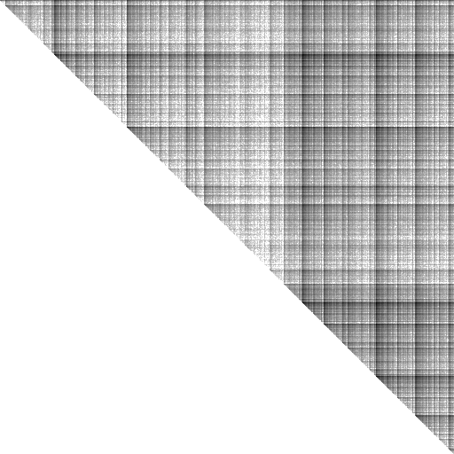 | 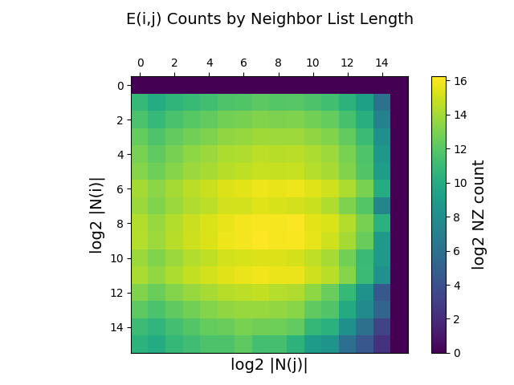