# viz

## SNAP

| Graph | edge binned by ID | nz binned by neighbor list |
|-|-|-|
amazon0302_adj | 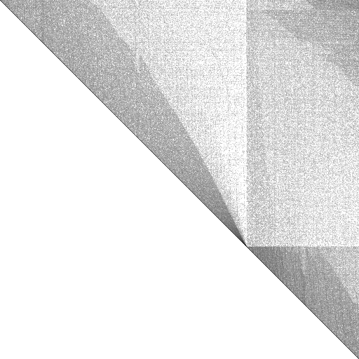 | 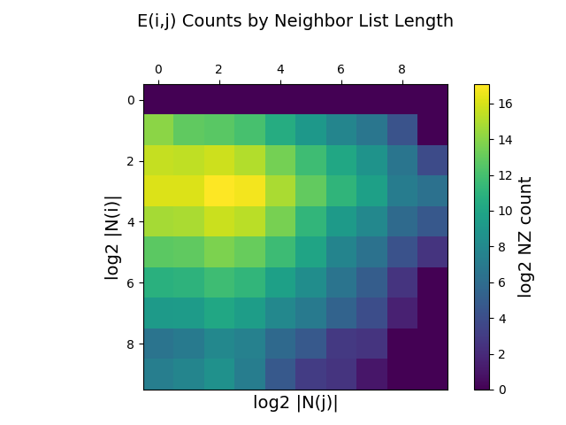
amazon0312_adj |  | 
amazon0505_adj |  | 
amazon0601_adj |  | 
as20000102_adj |  | 
ca-GrQc_adj |  | 
ca-HepPh_adj |  | 
ca-HepTh_adj |  | 
cit-Patents_adj |  | 
flickrEdges_adj | 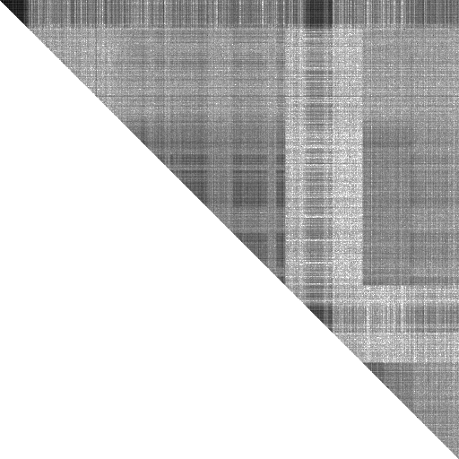 | 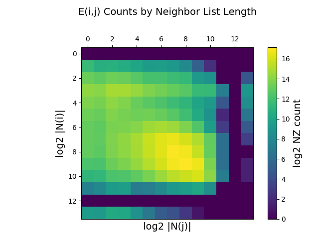
friendster_adj |  | 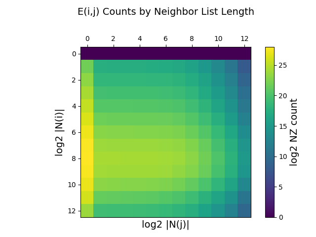
oregon1_010331_adj |  | 
oregon1_010421_adj |  | 
oregon1_010428_adj |  | 
oregon1_010519_adj |  | 
oregon1_010526_adj |  | 
p2p-Gnutella04_adj |  | 
p2p-Gnutella08_adj |  | 
p2p-Gnutella09_adj |  | 
roadNet-CA_adj |  | 
roadNet-PA_adj |  | 
roadNet-TX_adj | 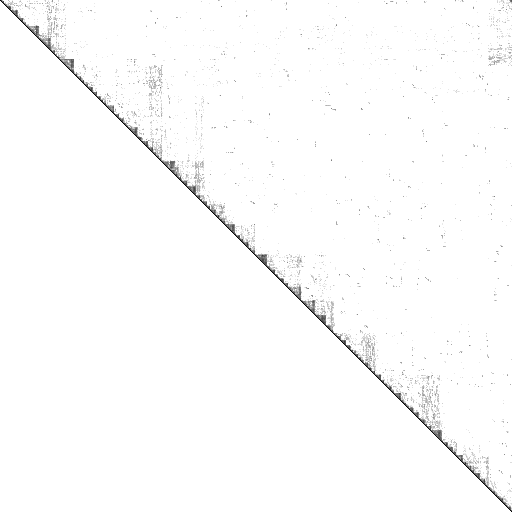 | 
soc-Slashdot0902_adj |  | 

## kmer

| Graph | edge binned by ID | nz binned by neighbor list |
|-|-|-|
A2a |  | 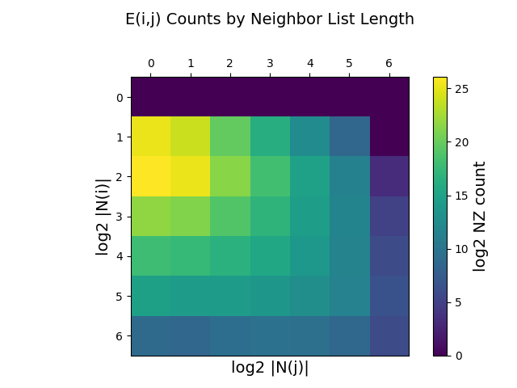
P1a |  | 
U1a |  | 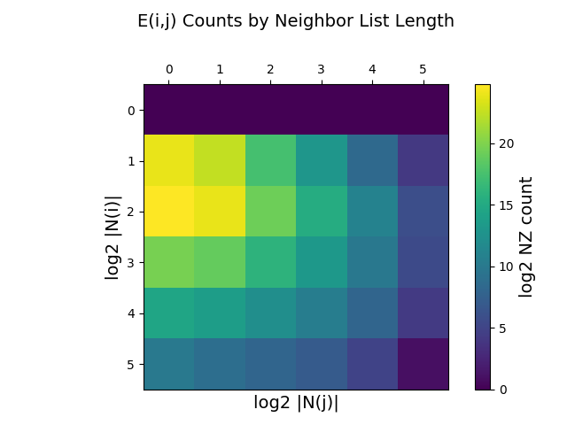
V1r |  | 
V2a |  | 

## MAWI

| Graph | edges binned by node IDs | edges binned by node nbr list size |
|-|-|-|
201512012345.v18571154_e38040320   |    | 
201512020330.v226196185_e480047894 | 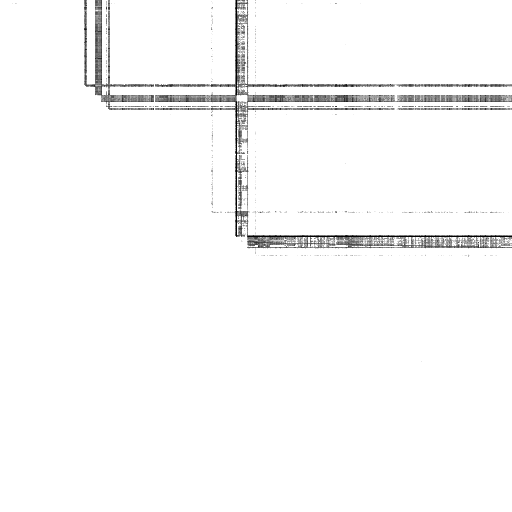 | 
201512020000.v35991342_e74485420   |    | 
201512020030.v68863315_e143414960  |   | 
201512020130.v128568730_e270234840 |  | 

## Graph Challenge "Synthetic"

| Graph | edge binned by ID | nz binned by neighbor list |
|-|-|-|
graph500-scale18-ef16_adj |  | 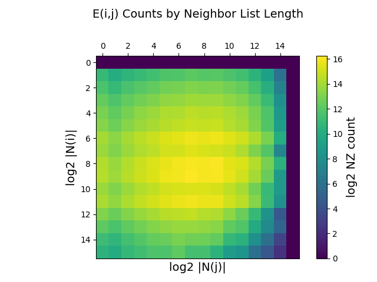
graph500-scale19-ef16_adj |  | 
graph500-scale20-ef16_adj | 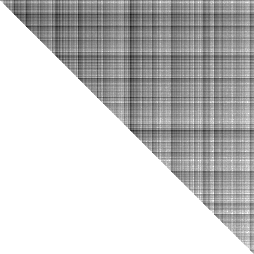 | 
graph500-scale21-ef16_adj |  | 
graph500-scale22-ef16_adj | 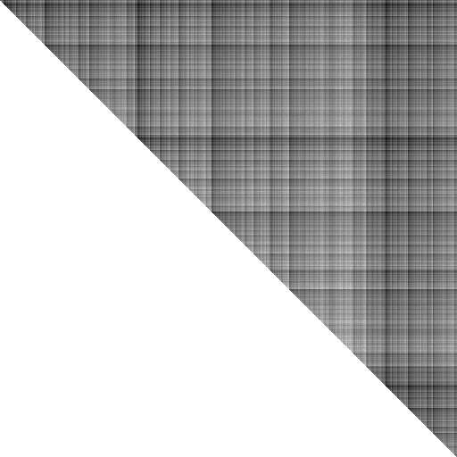 | 
graph500-scale23-ef16_adj | 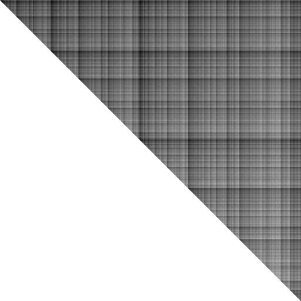 | 
graph500-scale24-ef16_adj | 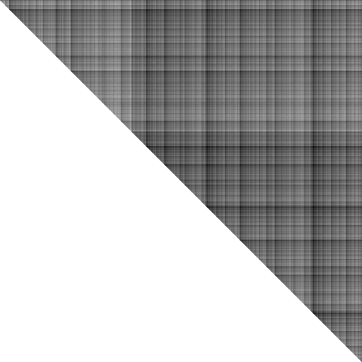 | 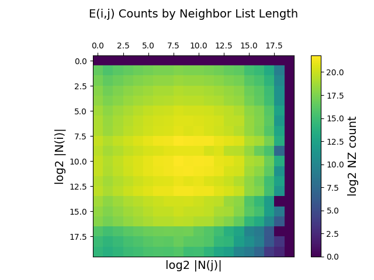

## Graph Challenge "Theory"

### Some Triangles

| Graph | edge binned by ID | nz binned by neighbor list |
|-|-|-|
Theory-16-25-81-B2k |  | 
Theory-16-25-81-B2k |  |  |
Theory-16-25-B2k |  |  |
Theory-256-625-B2k |  |  |
Theory-25-81-256-B2k |  |  |
Theory-25-81-B2k |  |  |
Theory-3-4-5-9-16-25-B2k |  |  |
Theory-3-4-5-9-16-B2k |  |  |
Theory-3-4-5-9-B2k |  |  |
Theory-3-4-5-B2k |  |  |
Theory-3-4-B2k |  |  |
Theory-4-5-9-16-25-B2k |  |  |
Theory-4-5-9-16-B2k |  |  |
Theory-4-5-9-B2k |  |  |
Theory-4-5-B2k |  |  |
Theory-5-9-16-25-81-B2k |  |  |
Theory-5-9-16-25-B2k |  |  |
Theory-5-9-16-B2k |  |  |
Theory-5-9-B2k |  |  |
Theory-81-256-B2k |  |  |
Theory-9-16-25-81-B2k |  |  |
Theory-9-16-25-B2k |  |  |
Theory-9-16-B2k |  |  |

### No Triangles

| Graph | edge binned by ID | nz binned by neighbor list |
|-|-|-|
Theory-16-25-81-Bk |  | 
Theory-16-25-81-Bk |  |  |
Theory-16-25-Bk |  |  |
Theory-256-625-Bk |  |  |
Theory-25-81-256-Bk |  |  |
Theory-25-81-Bk |  |  |
Theory-3-4-5-9-16-25-Bk |  |  |
Theory-3-4-5-9-16-Bk |  |  |
Theory-3-4-5-9-Bk |  |  |
Theory-3-4-5-Bk |  |  |
Theory-3-4-Bk |  |  |
Theory-4-5-9-16-25-Bk |  |  |
Theory-4-5-9-16-Bk |  |  |
Theory-4-5-9-Bk |  |  |
Theory-4-5-Bk |  |  |
Theory-5-9-16-25-81-Bk |  |  |
Theory-5-9-16-25-Bk |  |  |
Theory-5-9-16-Bk |  |  |
Theory-5-9-Bk |  |  |
Theory-81-256-Bk |  |  |
Theory-9-16-25-81-Bk |  |  |
Theory-9-16-25-Bk |  |  |
Theory-9-16-Bk |  |  |

### Many Triangles

| Graph | edge binned by ID | nz binned by neighbor list |
|-|-|-|
Theory-16-25-81-B1k |  | 
Theory-16-25-81-B1k |  |  |
Theory-16-25-B1k |  |  |
Theory-256-625-B1k |  |  |
Theory-25-81-256-B1k |  |  |
Theory-25-81-B1k |  |  |
Theory-3-4-5-9-16-25-B1k |  |  |
Theory-3-4-5-9-16-B1k |  |  |
Theory-3-4-5-9-B1k |  |  |
Theory-3-4-5-B1k |  |  |
Theory-3-4-B1k |  |  |
Theory-4-5-9-16-25-B1k |  |  |
Theory-4-5-9-16-B1k |  |  |
Theory-4-5-9-B1k |  |  |
Theory-4-5-B1k |  |  |
Theory-5-9-16-25-81-B1k |  |  |
Theory-5-9-16-25-B1k |  |  |
Theory-5-9-16-B1k |  |  |
Theory-5-9-B1k |  |  |
Theory-81-256-B1k |  |  |
Theory-9-16-25-81-B1k |  |  |
Theory-9-16-25-B1k |  |  |
Theory-9-16-B1k |  |  |
